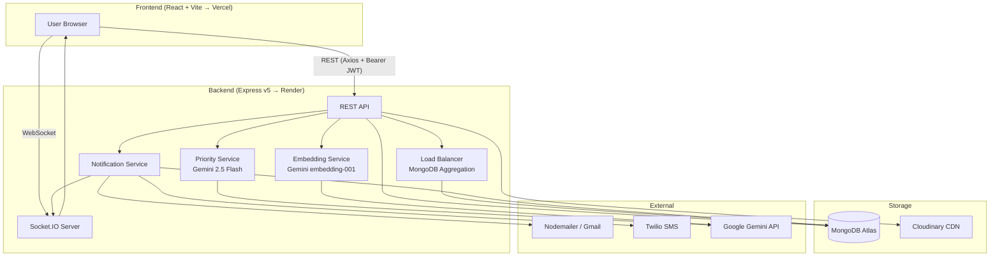
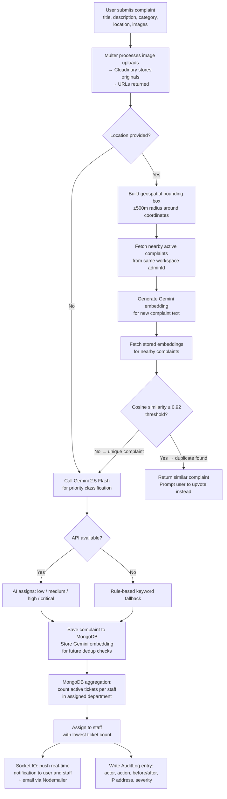
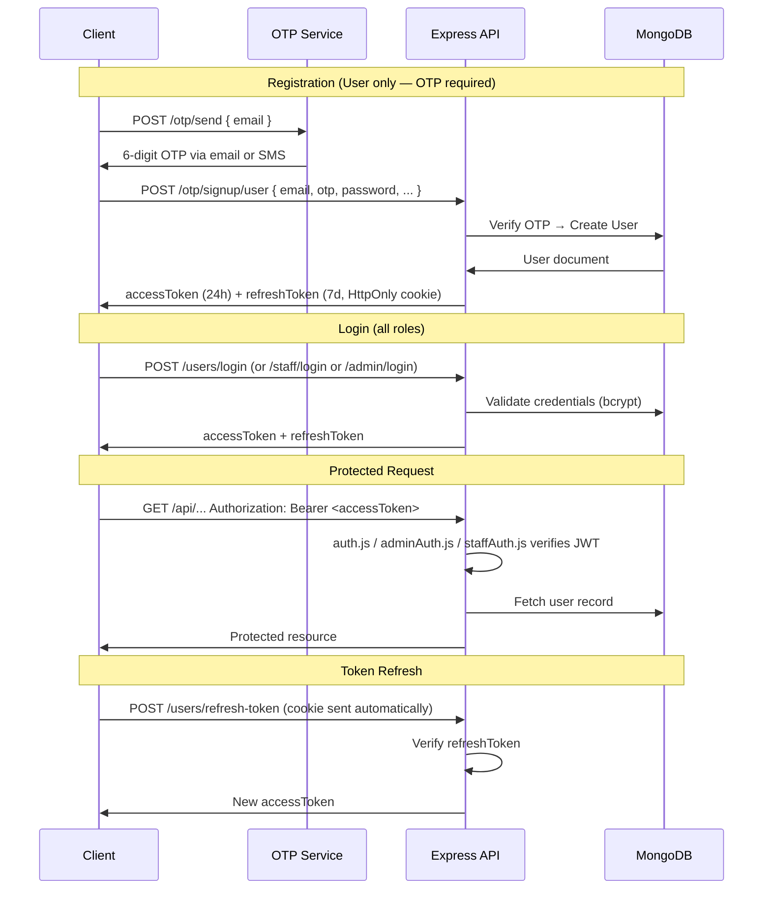
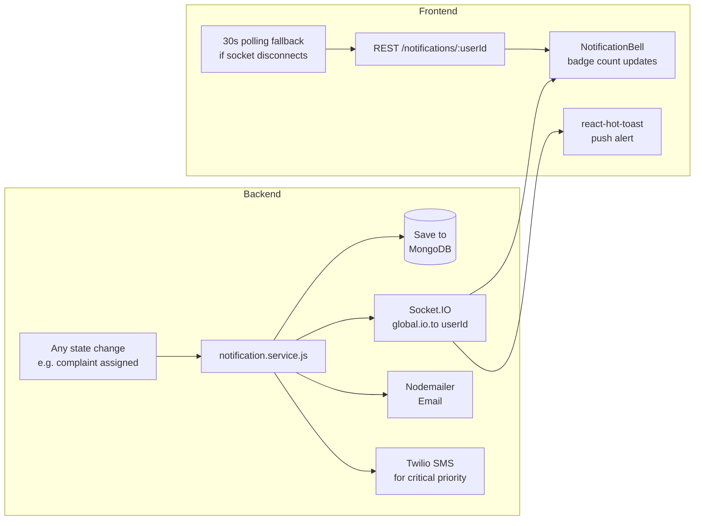

<div align="center">

# ResolveX

### Community Grievance Management Platform

**Report civic issues. Track resolution. Close the loop — in real time.**

[](https://nodejs.org)
[](https://react.dev)
[](https://expressjs.com)
[](https://mongodb.com)
[](https://socket.io)

[Overview](#overview) · [Features](#features) · [Architecture](#architecture) · [Getting Started](#getting-started) · [API Reference](#api-reference) · [Contributing](#contributing)

</div>

## Overview

ResolveX is a multi-tenant complaint management platform built for civic organizations, housing societies, and municipal bodies. It closes the gap between communities and the teams that serve them by providing a structured, accountable, AI-assisted pipeline for reporting, triaging, and resolving issues.

**The problem it solves:** Complaint management in most organizations is handled through emails, phone calls, or spreadsheets — with no audit trail, no priority logic, and no feedback loop for the person who raised the issue. ResolveX replaces that with a real-time, role-based system where every complaint is tracked from submission to closure.

**Who it's for:**
- **Citizens / residents** who want to report issues and track their status
- **Staff members** who need a structured queue of assigned tickets
- **Administrators** who oversee the entire pipeline, manage teams, and analyze performance

---

### 🏠 Landing Page


---

### 👤 User Dashboard


---

### 🛡️ Admin Dashboard


---

### 📊 Analytics Page


---

### 🔧 Staff Dashboard


---

## Features

### User-Facing
- Submit geo-tagged complaints with title, description, category, images, and GPS coordinates
- Real-time status tracking: `Pending → In Progress → Resolved`
- Upvote existing complaints to surface the most urgent community issues
- Receive in-app and email/SMS notifications on every status change
- Join multiple organizational workspaces with a 6-character workspace code
- Comment on complaints; view full thread history

### Staff-Facing
- Dedicated dashboard showing all complaints assigned to your department
- One-click status updates with comment threads per ticket
- Real-time chat with admin on individual complaints via Socket.IO
- Personal performance stats: resolution rate, active tickets, response time

### Admin-Facing
- Live dashboard with real-time complaint counts, user activity, and resolution rate
- Manual and automatic complaint assignment to staff
- AI-powered priority classification on every new complaint (Gemini 2.5 Flash with rule-based fallback)
- Override AI-assigned priority and track who changed what and when
- Staff management: create accounts, approve/reject, activate/deactivate
- User management: browse workspace members, view activity
- Department management with automatic complaint routing
- Full audit log: every admin and staff action is recorded with before/after diffs, IP address, actor role, and severity

### Analytics
- 11-metric analytics dashboard running parallel MongoDB aggregations
- Metrics: complaint trends, category breakdown, department performance, staff leaderboard, user engagement, resolution time, priority distribution, location heatmap, time-of-day analysis, period-over-period comparison
- Configurable date range: 7d / 30d / 90d / 1y
- One-click export to CSV or JSON

### AI & Intelligence
- **Duplicate detection:** Gemini `embedding-001` vector generation + cosine similarity search against geographically nearby active complaints (configurable threshold, default 0.92). Users are prompted to upvote an existing complaint rather than submit a duplicate.
- **Priority classification:** Gemini 2.5 Flash classifies each complaint as `low / medium / high / critical` using urgency, impact, and severity signals. Falls back to a keyword + category rule engine if the API is unavailable.
- **Load balancing:** MongoDB aggregation counts active tickets per staff member in the relevant department and auto-assigns the complaint to whoever has the lowest current load.

---

## Tech Stack

| Category | Technology | Notes |
|---|---|---|
| Frontend | React 19, Vite (rolldown), React Router 7 | ESM modules |
| Styling | Tailwind CSS v4, Framer Motion | Utility-first, animations |
| Charts | Recharts | Analytics dashboard |
| HTTP Client | Axios | With Bearer token interceptors |
| Real-time (client) | Socket.IO Client v4 | With 30s polling fallback |
| Backend | Node.js v18+, Express.js v5 | ESM modules |
| Database | MongoDB 8, Mongoose 8 | ODM with compound indexes |
| Real-time (server) | Socket.IO v4 | Room-based event routing |
| Authentication | JSON Web Token (JWT) | Access (24h) + Refresh (7d) |
| Password Hashing | bcryptjs | Salt rounds: 10 |
| OTP | Nodemailer (email), Twilio (SMS) | Registration + password reset |
| AI / LLM | Google Gemini 2.5 Flash | Priority classification |
| Embeddings | Gemini `embedding-001` | Duplicate detection via cosine similarity |
| Media Storage | Cloudinary v2, Multer v2 | Image upload + CDN delivery |
| Deployment (FE) | Vercel | SPA rewrites via `vercel.json` |
| Deployment (BE) | Render | `https://webster-2025.onrender.com` |

---

## Architecture

### System Overview



### Complaint Ingestion Pipeline

This is the most technically involved flow in the system. It runs every time a user submits a new complaint.



### Authentication Flow

ResolveX has three independent role namespaces, each verified by its own middleware.



### Real-Time Notification Architecture



---

## Project Structure

```
resolvex/
├── BACKEND/
│   ├── src/
│   │   ├── app.js                  # Express + Socket.IO setup, CORS, all routes
│   │   ├── index.js                # Entry point: DB connect → server.listen
│   │   ├── controllers/            # Request handlers (one file per domain)
│   │   │   ├── user_issue.controllers.js   # Full complaint pipeline
│   │   │   ├── analytics.controllers.js    # 11 parallel aggregations
│   │   │   ├── admin.controllers.js
│   │   │   ├── staff.controllers.js
│   │   │   └── ...
│   │   ├── models/
│   │   │   ├── UserComplaint.models.js     # Core complaint schema
│   │   │   ├── ComplaintEmbedding.model.js # Gemini embedding vectors
│   │   │   ├── AuditLog.models.js          # Full audit trail
│   │   │   ├── Admin.models.js             # Workspace + auto-gen code
│   │   │   ├── Staff.models.js             # Approval-gated staff
│   │   │   └── ...
│   │   ├── services/
│   │   │   ├── embedding.service.js  # Gemini embeddings + cosine similarity
│   │   │   ├── priority.service.js   # Gemini 2.5 Flash + rule-based fallback
│   │   │   └── notification.service.js
│   │   ├── middleware/
│   │   │   ├── auth.js               # User JWT verification
│   │   │   ├── adminAuth.js          # Admin JWT verification
│   │   │   ├── staffAuth.js          # Staff JWT verification
│   │   │   └── auditLogger.js        # Action logging middleware
│   │   ├── utils/
│   │   │   ├── loadBalancer.js       # MongoDB aggregation-based assignment
│   │   │   └── locationUtils.js      # Haversine, bounding box, Levenshtein
│   │   ├── routes/                   # One route file per domain
│   │   └── db/index.js               # Mongoose connection
│   ├── seeders/                      # Demo data scripts
│   └── package.json
│
└── FRONTEND/
    ├── src/
    │   ├── App.jsx                   # React Router routes + role guards
    │   ├── pages/
    │   │   ├── user/                 # Home, UserComplaintsPage
    │   │   ├── admin/                # Dashboard, Issues, Staff, Analytics, Audit, Chat
    │   │   └── staff/                # StaffDashboard, StaffIssuesPage
    │   └── components/
    │       ├── admin/                # AdminAnalyticsManager, etc.
    │       ├── auth/                 # Login, Register forms
    │       ├── chat/                 # Real-time chat components
    │       ├── common/               # Shared UI elements
    │       └── user/                 # Complaint forms, cards
    ├── vercel.json                   # SPA rewrite rules
    └── package.json
```

---

## Getting Started

### Prerequisites

| Requirement | Version | Notes |
|---|---|---|
| Node.js | v18+ | Required |
| MongoDB | Local or Atlas | Required |
| Cloudinary account | — | Required (free tier works) |
| Google Gemini API key | — | Optional — enables AI priority + duplicate detection |
| Twilio account | — | Optional — enables SMS notifications |
| Gmail account + App Password | — | Required for OTP emails |

### 1. Clone the repository

```bash
git clone https://github.com/your-username/resolvex.git
cd resolvex
```

### 2. Backend setup

```bash
cd BACKEND
npm install
```

Create a `.env` file in `BACKEND/`:

```env
# ── Server ───────────────────────────────────────────────────────
PORT=5000
NODE_ENV=development

# ── Database ──────────────────────────────────────────────────────
MONGODB_URI=mongodb://localhost:27017/resolvex
DB_NAME=resolvex

# ── JWT ───────────────────────────────────────────────────────────
ACCESS_TOKEN_SECRET=replace_with_a_long_random_string
REFRESH_TOKEN_SECRET=replace_with_a_different_long_random_string

# ── CORS / Client URLs ────────────────────────────────────────────
CLIENT_URL=http://localhost:5173
FRONTEND_URL=http://localhost:5173

# ── Cloudinary (required for image uploads) ───────────────────────
CLOUDINARY_CLOUD_NAME=your_cloud_name
CLOUDINARY_API_KEY=your_api_key
CLOUDINARY_API_SECRET=your_api_secret

# ── Email — Nodemailer (required for OTP) ─────────────────────────
EMAIL_USER=your_gmail@gmail.com
EMAIL_PASS=your_gmail_app_password   # Google App Password, not account password
EMAIL_FROM=ResolveX <your_gmail@gmail.com>
SMTP_HOST=smtp.gmail.com
SMTP_PORT=587

# ── Twilio (optional — SMS notifications) ─────────────────────────
TWILIO_SID=your_twilio_account_sid
TWILIO_AUTH=your_twilio_auth_token
TWILIO_PHONE=+1xxxxxxxxxx

# ── Google Gemini (optional — AI priority + duplicate detection) ───
GOOGLE_API_KEY=your_gemini_api_key
GEMINI_API_KEY=your_gemini_api_key   # Used specifically for embeddings

# ── Duplicate Detection Tuning (optional) ─────────────────────────
SIMILARITY_THRESHOLD=0.92            # Cosine similarity threshold (0–1)
```

> **Note on Gemini keys:** The priority service uses `GOOGLE_API_KEY` as primary and `GEMINI_API_KEY` as fallback. The embedding service uses `GEMINI_API_KEY`. Set both to the same value unless you want to separate quota.

**Seed demo data:**

```bash
npm run seed:all          # Seeds everything at once

# Or individually:
npm run seed:admin        # Creates default admin account + workspace
npm run seed:departments  # Creates sample departments
npm run seed:staff        # Creates demo staff members
npm run seed:users        # Creates demo user accounts
npm run seed:complaints   # Creates sample complaints with embeddings
```

**Start the backend:**

```bash
npm run dev    # Development with hot reload (nodemon)
npm start      # Production
```

The API and Socket.IO server both run on `http://localhost:5000`.

### 3. Frontend setup

```bash
cd FRONTEND
npm install
```

Create a `.env` file in `FRONTEND/`:

```env
VITE_API_URL=http://localhost:5000
```

**Start the development server:**

```bash
npm run dev
```

Open your browser at `http://localhost:5173`.

**Other frontend scripts:**

```bash
npm run build      # Production build (outputs to dist/)
npm run preview    # Preview the production build locally
npm run lint       # ESLint check
```

---

## Environment Variables Reference

### Backend

| Variable | Required | Description |
|---|---|---|
| `PORT` | Yes | Server port (default: `5000`) |
| `NODE_ENV` | Yes | `development` or `production` |
| `MONGODB_URI` | Yes | MongoDB connection string |
| `DB_NAME` | Yes | Database name |
| `ACCESS_TOKEN_SECRET` | Yes | JWT signing secret (access tokens) |
| `REFRESH_TOKEN_SECRET` | Yes | JWT signing secret (refresh tokens) |
| `CLIENT_URL` | Yes | Frontend URL for CORS |
| `FRONTEND_URL` | Yes | Frontend URL (used in Socket.IO CORS) |
| `CLOUDINARY_CLOUD_NAME` | Yes | Cloudinary cloud name |
| `CLOUDINARY_API_KEY` | Yes | Cloudinary API key |
| `CLOUDINARY_API_SECRET` | Yes | Cloudinary API secret |
| `EMAIL_USER` | Yes | Gmail address for sending OTP emails |
| `EMAIL_PASS` | Yes | Gmail App Password |
| `EMAIL_FROM` | Yes | Display name + address for outgoing emails |
| `SMTP_HOST` | Yes | SMTP host (e.g. `smtp.gmail.com`) |
| `SMTP_PORT` | Yes | SMTP port (e.g. `587`) |
| `TWILIO_SID` | Optional | Twilio Account SID (enables SMS) |
| `TWILIO_AUTH` | Optional | Twilio Auth Token |
| `TWILIO_PHONE` | Optional | Twilio sender phone number |
| `GOOGLE_API_KEY` | Optional | Gemini API key (AI priority classification) |
| `GEMINI_API_KEY` | Optional | Gemini API key (embedding-based duplicate detection) |
| `SIMILARITY_THRESHOLD` | Optional | Cosine similarity cutoff for duplicate detection (default: `0.92`) |

### Frontend

| Variable | Required | Description |
|---|---|---|
| `VITE_API_URL` | Yes | Backend base URL (e.g. `http://localhost:5000`) |

---

## API Reference

Base URL: `http://localhost:5000/api`

Health check: `GET /health` — no auth required

### Authentication

| Method | Endpoint | Auth | Description |
|---|---|---|---|
| `POST` | `/otp/send` | None | Send OTP to email or phone |
| `POST` | `/otp/signup/user` | None | Verify OTP → create user account |
| `POST` | `/otp/signup/admin` | None | Verify OTP → create admin + workspace |
| `POST` | `/users/login` | None | User login → returns JWT pair |
| `POST` | `/users/refresh-token` | None | Exchange refresh token for new access token |
| `POST` | `/users/logout` | User | Invalidate session |
| `POST` | `/staff/login` | None | Staff login |
| `POST` | `/admin/login` | None | Admin login |
| `POST` | `/admin/logout` | Admin | Admin logout (audited) |

### Complaints (User)

| Method | Endpoint | Auth | Description |
|---|---|---|---|
| `GET` | `/user_issues` | Public | List workspace complaints (filterable) |
| `GET` | `/user_issues/stats` | Public | Summary statistics |
| `GET` | `/user_issues/locations` | Public | Geo-coordinates for map view |
| `GET` | `/user_issues/my` | User | Current user's complaints |
| `POST` | `/user_issues/check-duplicate` | User | Pre-submission duplicate check |
| `POST` | `/user_issues` | User | Submit complaint (full AI pipeline) |
| `GET` | `/user_issues/:id` | Public | Single complaint details |
| `PUT` | `/user_issues/:id/upvote` | User | Upvote a complaint |
| `GET` | `/user_issues/:id/comments` | Public | Get comment thread |
| `POST` | `/user_issues/:id/comments` | User | Add comment |
| `DELETE` | `/user_issues/:id` | User | Delete own complaint |

### Admin

| Method | Endpoint | Auth | Description |
|---|---|---|---|
| `GET` | `/admin/dashboard` | Admin | Live dashboard metrics (audited) |
| `GET` | `/admin/stats/realtime` | Admin | Real-time counters |
| `GET` | `/admin/issues` | Admin | All workspace complaints |
| `PATCH` | `/admin/issues/:id/assign` | Admin | Assign complaint to staff |
| `GET` | `/admin/staff` | Admin | All staff + performance stats |
| `POST` | `/admin/staff` | Admin | Create staff account |
| `PATCH` | `/admin/staff/:id/approve` | Admin | Approve pending staff |
| `PATCH` | `/admin/staff/:id/reject` | Admin | Reject staff application |
| `GET` | `/admin/users` | Admin | All workspace users |
| `GET` | `/admin/departments` | Admin | All departments |
| `POST` | `/admin/departments` | Admin | Create department |
| `GET` | `/admin/analytics/comprehensive` | Admin | Full analytics payload (11 aggregations) |
| `GET` | `/admin/analytics/export` | Admin | Export data `?format=csv\|json&timeRange=30d` |
| `GET` | `/admin/profile` | Admin | Admin's own profile |
| `PUT` | `/admin/profile` | Admin | Update admin profile |

### Staff

| Method | Endpoint | Auth | Description |
|---|---|---|---|
| `GET` | `/staff/issues` | Staff | Complaints assigned to this staff member |
| `PATCH` | `/staff/issues/:id/status` | Staff | Update complaint status |

### Workspace

| Method | Endpoint | Auth | Description |
|---|---|---|---|
| `POST` | `/users/join-workspace` | User | Join workspace by 6-char code |
| `POST` | `/users/leave-workspace/:id` | User | Leave a workspace |
| `GET` | `/users/my-workspaces` | User | List joined workspaces |

### Notifications

| Method | Endpoint | Auth | Description |
|---|---|---|---|
| `GET` | `/notifications/:userId` | Any | Get notifications (`?limit=30&isRead=false`) |
| `PATCH` | `/notifications/:id/read` | Any | Mark as read |
| `PATCH` | `/notifications/:userId/read-all` | Any | Mark all as read |
| `DELETE` | `/notifications/:id` | Any | Delete notification |
| `DELETE` | `/notifications/:userId/clear-all` | Any | Clear all notifications |

### Audit

| Method | Endpoint | Auth | Description |
|---|---|---|---|
| `GET` | `/audit` | Admin | Query audit logs with filters |

### Assignment

| Method | Endpoint | Auth | Description |
|---|---|---|---|
| `POST` | `/assignment/auto-assign/:id` | Admin | Trigger load-balancer for a complaint |
| `POST` | `/assignment/manual-assign/:id` | Admin | Manually assign to a specific staff member |

---

## Database Schema Overview

### UserComplaint
The core model. All queries are scoped by `adminId` to enforce workspace isolation.

```
adminId       → workspace scope (indexed)
title, description, category
status        → pending | in-progress | resolved | rejected
priority      → low | medium | high | critical
autoPriorityAssigned, manualPriorityOverridden, priorityOverriddenAt
location      → { latitude, longitude, address }  (compound indexed)
images[]      → Cloudinary URLs
user          → ref: User
assignedTo    → ref: Staff
department    → ref: Department
voteCount, voters[]
comments[]    → { authorRole, message, createdAt, ref to User/Staff/Admin }
resolvedAt
```

### ComplaintEmbedding
Stores Gemini vector embeddings for duplicate detection.

```
complaintId   → ref: UserComplaint (unique)
embedding     → Number[] (Gemini embedding-001 vector)
embeddingText → the structured text that was embedded
model         → "gemini-embedding-001"
dimension     → vector length
```

### AuditLog
Immutable action trail. Never fails silently (errors are caught and logged separately so they never break the main request flow).

```
actor, actorModel, actorName, actorEmail, actorRole
action        → 40+ enumerated action types
targetModel, targetId, targetName
changes       → { before, after }  (Mixed type)
metadata      → { ipAddress, userAgent, endpoint, method, duration }
category      → AUTHENTICATION | USER_MANAGEMENT | ISSUE_MANAGEMENT | ...
severity      → LOW | MEDIUM | HIGH | CRITICAL
status        → SUCCESS | FAILURE | WARNING
```

Compound indexes on `(actor, timestamp)`, `(category, severity, timestamp)`, and `(targetModel, targetId)` ensure fast filtered queries on the audit log page.

---

## Security

| Mechanism | Detail |
|---|---|
| Password hashing | bcryptjs, 10 salt rounds |
| Access tokens | JWT, 24h expiry, signed with `ACCESS_TOKEN_SECRET` |
| Refresh tokens | JWT, 7d expiry, signed with `REFRESH_TOKEN_SECRET` |
| Role isolation | Three separate middleware files: `auth.js`, `adminAuth.js`, `staffAuth.js` |
| Workspace isolation | Every DB query scoped to `adminId` — no cross-workspace data leakage |
| Staff approval gate | New staff accounts require explicit admin approval before login is permitted |
| CORS | Strict allowlist; only `FRONTEND_URL` and localhost origins are permitted |
| Audit trail | All destructive or sensitive admin/staff operations are logged immutably |
| OTP verification | Email OTP required for new user and admin registration |
| File size limit | Express and Multer enforce a 10MB upload limit |

---

## Deployment

### Frontend → Vercel

The `FRONTEND/vercel.json` configures SPA rewriting so all routes resolve to `index.html`.

```bash
cd FRONTEND
npm run build
# Deploy the dist/ folder to Vercel, or connect the repo directly
```

Set the environment variable `VITE_API_URL` to your production backend URL in the Vercel dashboard.

### Backend → Render (or any Node.js host)

```bash
# Start command
node src/index.js

# Environment: set all variables from the Backend .env section above
```

> The backend and Socket.IO server share the same port — no separate WebSocket server is needed.

---

## Contributing

Contributions are welcome. Please follow these steps:

1. Fork the repository
2. Create a feature branch
   ```bash
   git checkout -b feature/your-feature-name
   ```
3. Make your changes and commit using [Conventional Commits](https://www.conventionalcommits.org/)
   ```
   feat:     New feature
   fix:      Bug fix
   docs:     Documentation changes
   refactor: Code restructure without behavior change
   perf:     Performance improvement
   chore:    Build, tooling, or dependency updates
   ```
4. Push to your fork and open a Pull Request against `main`

### Things to note before contributing

- Both backend and frontend use **ES Modules** (`"type": "module"` in both `package.json` files). Use `import`/`export` syntax throughout.
- The backend uses **Express v5** — some v4 patterns (e.g. `app.param()` behavior, error handler signatures) differ.
- The frontend uses **Tailwind CSS v4** with the Vite plugin — do not use the v3 PostCSS-based setup.
- There are currently no automated tests. If you're adding a new feature, consider adding integration test coverage as part of your PR.
- There is no Docker setup — run MongoDB locally or use Atlas.

---

## Known Limitations

- No automated test suite (unit or integration tests are not present in the current codebase)
- No Docker or Docker Compose setup — local development requires manual service setup
- No CI/CD pipeline configured
- PDFKit is listed as a dependency but PDF export is not currently wired to a route — **CSV and JSON export are functional**
- Socket.IO rooms use plain user IDs as room names; in a high-scale production environment, consider namespacing

---

<div align="center">

Made with care by the ResolveX team · [Back to top](#resolvex)

</div>
