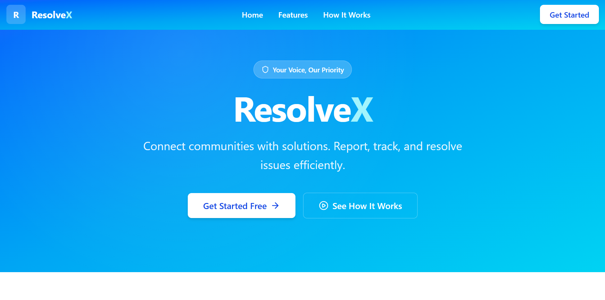
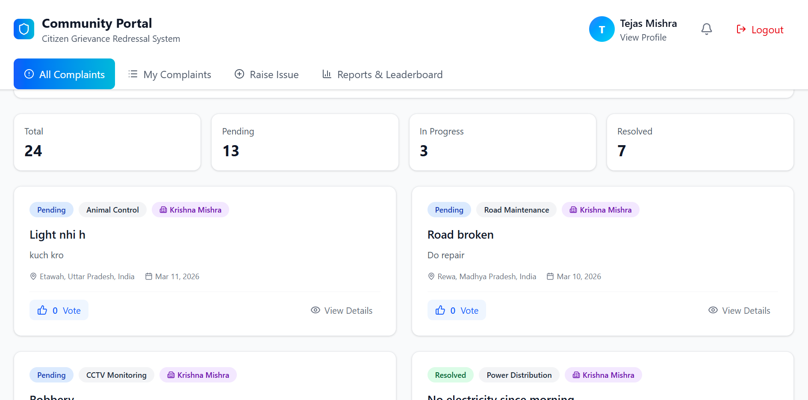
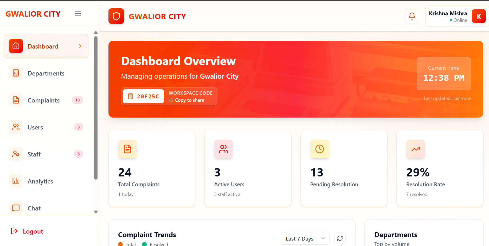
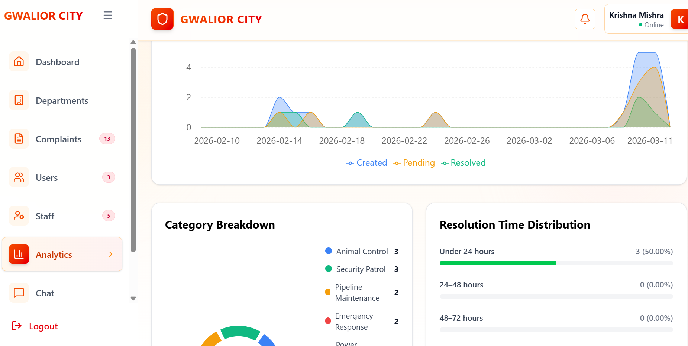
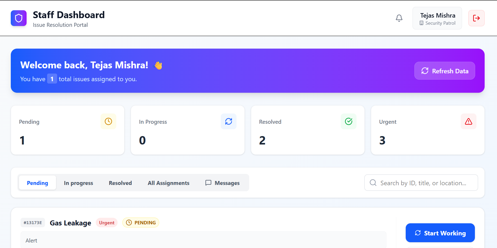

<div align="center">


# ResolveX

### Community Issue Management Platform

**Connect communities with solutions. Report, track, and resolve issues efficiently.**

[](https://nodejs.org)
[](https://react.dev)
[](https://mongodb.com)
[](https://socket.io)
[](https://tailwindcss.com)
[](./LICENSE)

[Features](#-features) · [Screenshots](#-screenshots) · [Tech Stack](#-tech-stack) · [Getting Started](#-getting-started) · [API Reference](#-api-reference) · [Contributing](#-contributing)

</div>

---

## 📖 Overview

ResolveX is a production-ready full-stack platform that bridges the gap between communities and the organizations that serve them. Citizens can report civic issues (roads, water, electricity, sanitation, etc.), staff members manage and resolve complaints assigned to their department, and administrators maintain complete oversight through a live analytics dashboard — all in real time.

Built for hackathons, municipal bodies, housing societies, or any organization that needs structured complaint management with accountability.

---

### 🏠 Landing Page


---

### 👤 User Dashboard


---

### 🛡️ Admin Dashboard


---

### 📊 Analytics Page


---

### 🔧 Staff Dashboard


---

## ✨ Features

### For Users
| Feature | Description |
|---|---|
| 📝 Issue Reporting | Submit complaints with title, description, category, priority, GPS location, and image attachments |
| 📍 Live Status Tracking | Watch complaint move from Pending → In Progress → Resolved in real time |
| 👍 Upvote System | Upvote community issues to surface the most urgent problems |
| 🗂️ My Complaints | Full history of personal submissions with delete capability |
| 🔔 Push Notifications | In-app bell + browser push notifications via Socket.IO (with 30s polling fallback) |
| 🏢 Workspace System | Join an organization using a unique 6-character workspace code |
| 🏆 Leaderboard | See which community members contribute most to issue resolution |
| 🔐 OTP Verification | Email OTP for registration and password reset |

### For Staff
| Feature | Description |
|---|---|
| 📋 Issue Queue | View and filter complaints assigned to your department |
| ✅ Status Updates | Mark issues in-progress or resolved with a single click |
| 🔍 Complaint Detail | Full context view — images, location map link, history, tags |
| 💬 Live Chat | Real-time chat with admin on each assigned complaint |
| 📊 Performance Stats | Track personal resolution rate and assigned ticket counts |
| 🔔 Notifications | Receive real-time alerts on new assignments and priority changes |

### For Admins
| Feature | Description |
|---|---|
| 📊 Live Dashboard | Real-time stats: total complaints, users, resolution rate, daily activity feed |
| 📂 Complaint Management | Assign complaints to staff, filter by status/department/priority, view detail |
| 👥 Staff Management | Create, approve/reject, activate/deactivate staff accounts with performance data |
| 👤 User Management | Browse and manage registered workspace users |
| 📈 Advanced Analytics | Multi-dimensional charts with date-range filters and trend analysis |
| 📤 Data Export | Export analytics as **CSV** or **JSON** with one click |
| 🗂️ Department Management | Create and manage departments that route complaints automatically |
| 📋 Audit Logs | Immutable action trail for every admin/staff operation |
| 💬 Chat Inbox | Manage conversations with users and staff across all tickets |
| 🔑 Workspace Code | Unique shareable code for users to join your workspace |
| 🤖 AI Priority Assignment | Gemini Pro AI auto-assigns complaint priority (with rule-based fallback) |

---

## 🛠 Tech Stack

### Backend

| Technology | Version | Purpose |
|---|---|---|
| **Node.js** | v18+ | Runtime environment |
| **Express.js** | v5 | REST API framework |
| **MongoDB** | v8 | Primary database |
| **Mongoose** | v8.x | ODM / schema management |
| **Socket.IO** | v4.x | Real-time bidirectional communication |
| **JSON Web Token** | v9 | Stateless authentication (access + refresh tokens) |
| **Cloudinary** | v2 | Image upload and CDN storage |
| **Multer** | v2 | Multipart/form-data file handling |
| **Nodemailer** | v7 | Transactional email (OTP, notifications) |
| **Twilio** | v5 | SMS notifications |
| **bcryptjs** | v3 | Password hashing |
| **PDFKit** | v0.17 | PDF report generation |
| **nodemon** | v3 | Dev server hot-reload |

### Frontend

| Technology | Version | Purpose |
|---|---|---|
| **React** | v18 | Component UI framework |
| **React Router** | v6 | Client-side SPA routing |
| **Tailwind CSS** | v3 | Utility-first CSS framework |
| **Framer Motion** | latest | Animations and transitions |
| **Recharts** | latest | Analytics charts and graphs |
| **Axios** | latest | HTTP client with interceptors |
| **Socket.IO Client** | v4 | Real-time event subscription |
| **Lucide React** | latest | Icon library |
| **React Hot Toast** | latest | Toast notifications |
| **Vite** | latest | Build tool and dev server |

---

## 🚀 Getting Started

### Prerequisites

- **Node.js** v18 or higher — [Download](https://nodejs.org)
- **MongoDB** running locally or a free [MongoDB Atlas](https://www.mongodb.com/atlas) cluster
- **Cloudinary** account for image uploads — [Sign up free](https://cloudinary.com)
- (Optional) **Twilio** account for SMS notifications
- (Optional) **Google Gemini API key** for AI priority assignment

---

### 1. Clone the Repository

```bash
git clone https://github.com/your-username/resolvex.git
cd resolvex
```

---

### 2. Backend Setup

```bash
cd backend
npm install
```

Create a `.env` file inside the `backend/` directory:

```env
# ── Server ──────────────────────────────────────
PORT=5000
NODE_ENV=development
CORS_ORIGIN=http://localhost:5173

# ── Database ─────────────────────────────────────
MONGODB_URI=mongodb://localhost:27017/resolvex
DB_NAME=resolvex

# ── JWT ──────────────────────────────────────────
ACCESS_TOKEN_SECRET=your_very_strong_access_secret_here
REFRESH_TOKEN_SECRET=your_very_strong_refresh_secret_here
ACCESS_TOKEN_EXPIRY=15m
REFRESH_TOKEN_EXPIRY=7d

# ── Cloudinary ───────────────────────────────────
CLOUDINARY_CLOUD_NAME=your_cloud_name
CLOUDINARY_API_KEY=your_api_key
CLOUDINARY_API_SECRET=your_api_secret

# ── Email (Gmail App Password) ───────────────────
EMAIL_USER=your_email@gmail.com
EMAIL_PASS=your_gmail_app_password

# ── Twilio (optional, for SMS) ───────────────────
TWILIO_SID=your_twilio_account_sid
TWILIO_AUTH=your_twilio_auth_token
TWILIO_PHONE=+1xxxxxxxxxx

# ── Google Gemini AI (optional, for AI priority) ──
GOOGLE_API_KEY=your_gemini_api_key

# ── Frontend URL ─────────────────────────────────
CLIENT_URL=http://localhost:5173
```

**Seed the database** with demo data (admin + departments + staff + users + complaints):

```bash
npm run seed:all
```

Or seed individual collections:

```bash
npm run seed:admin        # Creates the default admin account
npm run seed:departments  # Creates sample departments
npm run seed:staff        # Creates demo staff members
npm run seed:users        # Creates demo user accounts
npm run seed:complaints   # Creates sample complaints
```

**Start the backend server:**

```bash
npm run dev      # Development (with hot reload)
npm start        # Production
```

The API will be available at `http://localhost:5000`.

---

### 3. Frontend Setup

```bash
cd frontend
npm install
```

Create a `.env` file inside the `frontend/` directory:

```env
VITE_API_URL=http://localhost:5000
```

**Start the development server:**

```bash
npm run dev
```

Open your browser at **`http://localhost:5173`**.

---

## 👤 User Roles & Authentication

ResolveX implements a **three-tier role system** with separate JWT token namespaces:

| Role | Login Method | Token Key | Dashboard |
|---|---|---|---|
| **User** | Email + Password (+ OTP verification) | `accessToken` | `/home` |
| **Staff** | Staff ID or Email + Password | `staffToken` | `/staff/dashboard` |
| **Admin** | Admin ID + Password | `adminToken` | `/admin/dashboard` |

### Authentication Flow

```
User submits credentials
    ↓
Backend validates + signs JWT (access token 15m + refresh token 7d)
    ↓
Frontend stores in localStorage
    ↓
All protected API calls send: Authorization: Bearer <token>
    ↓
Role-specific middleware (auth.js / adminAuth.js / staffAuth.js) verifies
    ↓
Access granted or 401/403 returned
```

### Workspace System

Users don't share data across organizations. Each Admin creates an isolated workspace with a unique 6-character code. Users must enter this code during registration to join. All complaints, staff, and analytics are scoped to the admin's workspace.

---

## 🔌 API Reference

### Base URL
```
http://localhost:5000/api
```

### Authentication Endpoints

| Method | Endpoint | Auth | Description |
|---|---|---|---|
| `POST` | `/users/register` | None | Register new user |
| `POST` | `/users/login` | None | User login |
| `POST` | `/users/logout` | User | User logout |
| `POST` | `/users/refresh` | None | Refresh access token |
| `POST` | `/staff/login` | None | Staff login |
| `POST` | `/admin/login` | None | Admin login |
| `POST` | `/otp/send` | None | Send OTP to email |
| `POST` | `/otp/verify` | None | Verify OTP |

### User Complaint Endpoints

| Method | Endpoint | Auth | Description |
|---|---|---|---|
| `GET` | `/user_issues` | User | List all workspace complaints |
| `POST` | `/user_issues` | User | Submit new complaint |
| `GET` | `/user_issues/:id` | Any | Get complaint details |
| `PUT` | `/user_issues/:id` | User | Update own complaint |
| `DELETE` | `/user_issues/:id` | User | Delete own complaint |
| `PUT` | `/user_issues/:id/vote` | User | Upvote a complaint |

### Admin Endpoints

| Method | Endpoint | Auth | Description |
|---|---|---|---|
| `GET` | `/admin/dashboard` | Admin | Live dashboard stats + recent activity |
| `GET` | `/admin/analytics/chart` | Admin | Chart data (query: `?range=7d\|30d\|90d\|1y`) |
| `GET` | `/admin/staff` | Admin | List all staff |
| `POST` | `/admin/staff` | Admin | Create staff account |
| `PATCH` | `/admin/staff/:id/approve` | Admin | Approve pending staff |
| `PATCH` | `/admin/staff/:id/reject` | Admin | Reject staff application |
| `DELETE` | `/admin/staff/:id` | Admin | Remove staff |
| `GET` | `/admin/users` | Admin | List workspace users |
| `GET` | `/admin/issues` | Admin | List all complaints |
| `PATCH` | `/admin/issues/:id/assign` | Admin | Assign to staff |
| `PATCH` | `/admin/issues/:id/resolve` | Admin | Mark as resolved |
| `GET` | `/admin/departments` | Admin | List departments |
| `POST` | `/admin/departments` | Admin | Create department |

### Analytics Endpoints

| Method | Endpoint | Auth | Description |
|---|---|---|---|
| `GET` | `/admin/analytics/comprehensive` | Admin | Full analytics payload |
| `GET` | `/admin/analytics/export` | Admin | Export data (`?format=csv\|json&timeRange=30d`) |

### Notification Endpoints

| Method | Endpoint | Auth | Description |
|---|---|---|---|
| `GET` | `/notifications/:userId` | Any | Get user notifications (query: `?limit=30&isRead=false`) |
| `PATCH` | `/notifications/:id/read` | Any | Mark single notification as read |
| `PATCH` | `/notifications/:userId/read-all` | Any | Mark all as read |
| `DELETE` | `/notifications/:id` | Any | Delete single notification |
| `DELETE` | `/notifications/:userId/clear-all` | Any | Clear all notifications |

### Staff Endpoints

| Method | Endpoint | Auth | Description |
|---|---|---|---|
| `GET` | `/staff/issues` | Staff | Get assigned complaints |
| `PATCH` | `/staff/issues/:id/status` | Staff | Update complaint status |

### Audit Endpoints

| Method | Endpoint | Auth | Description |
|---|---|---|---|
| `GET` | `/audit` | Admin | Query audit logs with filters |

---

## 🔔 Real-Time Architecture

ResolveX uses **Socket.IO** for bidirectional real-time communication with a polling fallback:

```
Client connects to Socket.IO server
    ↓
Client emits "register" with userId
    ↓
Server joins client to a room named userId
    ↓
When a relevant event occurs (status change, assignment, new complaint):
    Backend notification.service.js
        → Saves notification to MongoDB
        → Emits "notification" event to userId room
        → Optionally sends email (Nodemailer) and/or SMS (Twilio)
    ↓
Client receives notification event
    → NotificationBell updates badge count
    → Browser push notification (if permission granted)
    ↓
Polling fallback: every 30 seconds if socket disconnects
```

**Events emitted by server:**
| Event | Payload | Trigger |
|---|---|---|
| `notification` | `{ title, message, type, complaintId, actionUrl }` | Any complaint status change, assignment, or priority update |

---

## 🤖 AI Priority Assignment

When a user submits a complaint, the `priority.service.js` automatically assigns a priority level using:

1. **Gemini Pro AI** (if `GOOGLE_API_KEY` is set) — sends complaint title, description, and category to Gemini for contextual priority analysis
2. **Rule-based fallback** — keyword matching against urgency indicators (e.g., "accident", "fire", "flood" → `critical`; "broken", "damaged" → `high`)

Admins and staff can always manually override the AI-assigned priority, and overrides are tracked in the complaint record.

---

## 🔐 Security

| Mechanism | Implementation |
|---|---|
| Password hashing | bcryptjs with salt rounds |
| Authentication | JWT access tokens (15m) + refresh tokens (7d) |
| Role isolation | Separate middleware per role (auth, adminAuth, staffAuth) |
| Token expiry checks | App validates and auto-clears expired tokens on load |
| CORS | Configured to allow only `CLIENT_URL` origin |
| Audit logging | All admin/staff actions are logged with actor, action, resource, and IP |
| OTP verification | Time-limited OTP for email verification and password reset |
| Workspace scoping | All DB queries are scoped to `adminId` — no cross-workspace data leakage |

---

## 📊 Data Models

### UserComplaint (Core)
```
title, description, category, status, priority
autoPriorityAssigned, manualPriorityOverridden
user (ref), assignedTo (ref), adminId (ref)
images[], tags[], location, latitude, longitude
voteCount, voters[]
createdAt, updatedAt, resolvedAt
```

### Notification
```
userId, recipientType (User | Staff | Admin)
type (info | success | warning | error | update | status_change | assignment | ...)
title, message, isRead
complaintId (ref), actionUrl
createdAt
```

### AuditLog
```
performedBy (ref), performerModel, performerRole
action, targetModel, targetId
details, ipAddress, userAgent
severity (LOW | MEDIUM | HIGH | CRITICAL)
createdAt
```

---

## 🤝 Contributing

1. **Fork** the repository
2. **Create** a feature branch
   ```bash
   git checkout -b feature/your-feature-name
   ```
3. **Commit** your changes
   ```bash
   git commit -m "feat: add your feature description"
   ```
4. **Push** to your branch
   ```bash
   git push origin feature/your-feature-name
   ```
5. **Open a Pull Request** against `main`

### Commit Message Convention

```
feat:     New feature
fix:      Bug fix
docs:     Documentation change
style:    Formatting, no logic change
refactor: Code restructure, no feature change
perf:     Performance improvement
test:     Adding or updating tests
chore:    Build process or tooling change
```

---

## 📁 Environment Variables Reference

### Backend `.env`

| Variable | Required | Description |
|---|---|---|
| `PORT` | Yes | Server port (default: `5000`) |
| `MONGODB_URI` | Yes | MongoDB connection string |
| `DB_NAME` | Yes | Database name |
| `ACCESS_TOKEN_SECRET` | Yes | JWT access token signing secret |
| `REFRESH_TOKEN_SECRET` | Yes | JWT refresh token signing secret |
| `ACCESS_TOKEN_EXPIRY` | Yes | Access token TTL (e.g. `15m`) |
| `REFRESH_TOKEN_EXPIRY` | Yes | Refresh token TTL (e.g. `7d`) |
| `CLOUDINARY_CLOUD_NAME` | Yes | Cloudinary cloud name |
| `CLOUDINARY_API_KEY` | Yes | Cloudinary API key |
| `CLOUDINARY_API_SECRET` | Yes | Cloudinary API secret |
| `EMAIL_USER` | Yes | Gmail address for sending emails |
| `EMAIL_PASS` | Yes | Gmail App Password |
| `CLIENT_URL` | Yes | Frontend URL for CORS |
| `TWILIO_SID` | Optional | Twilio Account SID (SMS) |
| `TWILIO_AUTH` | Optional | Twilio Auth Token |
| `TWILIO_PHONE` | Optional | Twilio sender phone number |
| `GOOGLE_API_KEY` | Optional | Gemini AI API key for priority analysis |

### Frontend `.env`

| Variable | Required | Description |
|---|---|---|
| `VITE_API_URL` | Yes | Backend API base URL |

---

<div align="center">

Made with ❤️ by the ResolveX team

**[⬆ Back to top](#resolvex)**

</div>